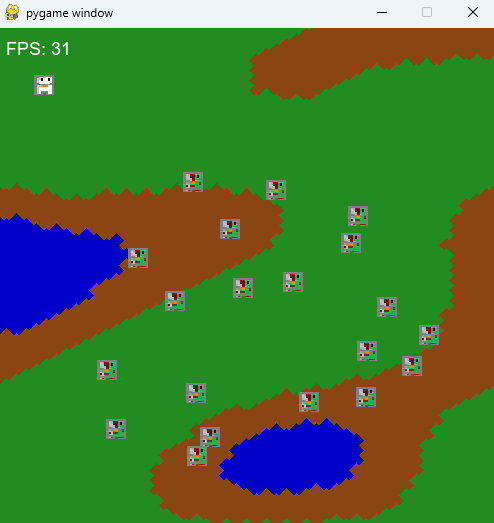
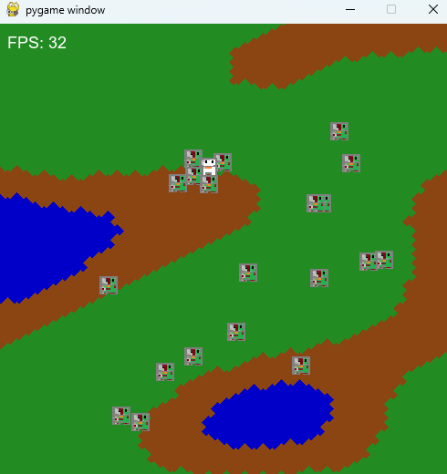
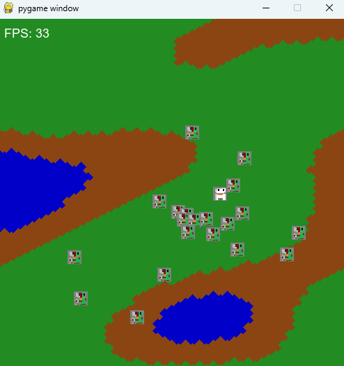
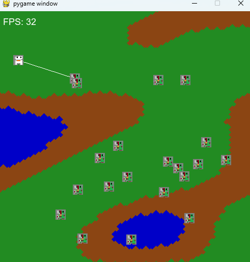

# Zombies-Game
A rudimentry game

Game controls:

Player:  
W : up  
S : down  
A : left
D : right

Mouse right click: shoots a beam

Start game player spawns at prespecfied location:                      
                

                    
Collisions are with all solid object which are prespecfied (zombies,player):                            
        
                        
  
Zombies chase player once player has entered a prespecied area (deteaction area):                             
        
                

Pointer draws a line from player location to clicked location (for a bullet path)                                  
       

  
